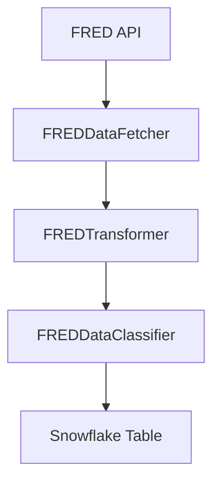

# FRED Economic Data Schema Documentation

## Overview

This document describes the schema and data structure for the Federal Reserve Economic Data (FRED) pipeline. The pipeline collects, processes, and stores key economic indicators that are particularly relevant for retail analysis.

## Table Schema

### Table: RETAIL_DATA_WAREHOUSE.RAW_DATA.FRED_ECONOMIC_DATA

#### Primary Purpose

Stores monthly economic indicators from FRED that are relevant for retail analysis and forecasting.

#### Columns

| Column Name | Data Type | Description | Constraints | Source Series |
|------------|-----------|-------------|-------------|---------------|
| month | DATE | Month in YYYY-MM-DD format | PRIMARY KEY, NOT NULL | - |
| consumer_confidence | FLOAT | University of Michigan Consumer Sentiment Index | NULL allowed | UMCSENT |
| unemployment_rate | FLOAT | Unemployment Rate as percentage | NULL allowed | UNRATE |
| inflation_rate | FLOAT | Consumer Price Index for All Urban Consumers | NULL allowed | CPIAUCSL |
| gdp_growth_rate | FLOAT | Real GDP Growth Rate (quarter-over-quarter) | NULL allowed | A191RL1Q225SBEA |
| federal_funds_rate | FLOAT | Federal Funds Effective Rate | NULL allowed | FEDFUNDS |
| retail_sales | FLOAT | Retail Sales Growth Rate | NULL allowed | RSXFS |
| last_updated | TIMESTAMP_NTZ | Timestamp of last data update | NOT NULL, DEFAULT CURRENT_TIMESTAMP() | - |
| loaded_at | TIMESTAMP_NTZ | Timestamp of data load into Snowflake | NOT NULL, DEFAULT CURRENT_TIMESTAMP() | - |

## Metric Details

### Consumer Confidence (UMCSENT)

- **Description**: Measures consumer sentiment and confidence in the economy
- **Range**: 0-150 (typical range)
- **Interpretation**:
  - >100: Positive consumer outlook
  - <100: Negative consumer outlook

### Unemployment Rate (UNRATE)

- **Description**: Percentage of the labor force that is unemployed
- **Range**: 0-100%
- **Interpretation**:
  - <5%: Low unemployment
  - 5-10%: Moderate unemployment
  - >10%: High unemployment

### Inflation Rate (CPIAUCSL)

- **Description**: Consumer Price Index changes indicating inflation rate
- **Range**: Typically -2% to 10%
- **Interpretation**:
  - 0-3%: Low inflation
  - 3-5%: Moderate inflation
  - >5%: High inflation

### GDP Growth Rate (A191RL1Q225SBEA)

- **Description**: Quarter-over-quarter real GDP growth rate
- **Range**: Typically -10% to 10%
- **Interpretation**:
  - >2%: Strong growth
  - 0-2%: Moderate growth
  - <0%: Economic contraction

### Federal Funds Rate (FEDFUNDS)

- **Description**: Interest rate at which banks lend money to each other overnight
- **Range**: 0-20%
- **Interpretation**:
  - 0-2%: Low rate environment
  - 2-5%: Moderate rate environment
  - >5%: High rate environment

### Retail Sales (RSXFS)

- **Description**: Growth rate in retail and food services sales
- **Range**: Typically -20% to 20%
- **Interpretation**:
  - >5%: Strong growth
  - 0-5%: Moderate growth
  - <0%: Decline

## Data Pipeline Structure

## Data Update Frequency

- Pipeline runs daily at 6 AM UTC
- Data is typically updated monthly by FRED
- Historical data from 2019-10-01 onwards is maintained

## Data Quality Rules

1. Month column must be unique (enforced by PRIMARY KEY)
2. All metric values must be numeric (FLOAT)
3. NULL values are allowed for metrics (data may be delayed or unavailable)
4. Timestamps are automatically set for tracking data freshness

## Usage Notes

- All percentage values are stored as decimals (e.g., 5% is stored as 5.0)
- Missing values are represented as NULL
- Historical revisions are handled through the MERGE operation
- Data lineage is tracked through last_updated and loaded_at timestamps