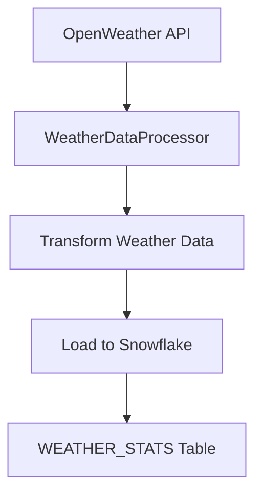

# Weather Data Pipeline Schema Documentation

## Overview

This document describes the schema and data structure for the OpenWeather data pipeline. The pipeline collects, processes, and stores weather statistics that are particularly relevant for retail analysis and operations planning.

## Table Schema

### Table: RETAIL_DATA_WAREHOUSE.RAW_DATA.WEATHER_STATS

#### Primary Purpose

Stores monthly weather statistics by state, providing comprehensive meteorological data for business analysis and planning.

#### Columns

| Column Name | Data Type | Description | Constraints |
|------------|-----------|-------------|-------------|
| state | VARCHAR(2) | Two-letter state code | PRIMARY KEY (composite), NOT NULL |
| month | VARCHAR(2) | Month in MM format | PRIMARY KEY (composite), NOT NULL |
| mean_temp | FLOAT | Average temperature for the period | NOT NULL |
| mean_pressure | FLOAT | Average atmospheric pressure | NOT NULL |
| mean_humidity | FLOAT | Average relative humidity percentage | NOT NULL |
| mean_wind | FLOAT | Average wind speed | NOT NULL |
| mean_precipitation | FLOAT | Average precipitation amount | NOT NULL |
| mean_clouds | FLOAT | Average cloud coverage percentage | NOT NULL |
| sunshine_hours_total | FLOAT | Total hours of sunshine | NOT NULL |
| loaded_at | TIMESTAMP_NTZ | Timestamp of data load | DEFAULT CURRENT_TIMESTAMP() |

## Metric Details

### Temperature (mean_temp)

- **Description**: Average temperature over the period
- **Unit**: Degrees (typically Celsius)
- **Typical Range**: -30 to 45°C
- **Business Impact**: Affects customer behavior and product demand

### Atmospheric Pressure (mean_pressure)

- **Description**: Average atmospheric pressure
- **Unit**: hPa (hectopascals)
- **Typical Range**: 970 to 1050 hPa
- **Business Impact**: Indicator of weather changes and potential severe weather conditions

### Humidity (mean_humidity)

- **Description**: Average relative humidity
- **Unit**: Percentage (%)
- **Range**: 0-100%
- **Business Impact**: Affects customer comfort and certain product categories

### Wind Speed (mean_wind)

- **Description**: Average wind speed
- **Unit**: meters/second (m/s)
- **Typical Range**: 0-30 m/s
- **Business Impact**: Affects outdoor shopping patterns and facility operations

### Precipitation (mean_precipitation)

- **Description**: Average rainfall/snowfall amount
- **Unit**: millimeters (mm)
- **Typical Range**: 0-500mm
- **Business Impact**: Significant impact on foot traffic and shopping patterns

### Cloud Coverage (mean_clouds)

- **Description**: Average cloud coverage
- **Unit**: Percentage (%)
- **Range**: 0-100%
- **Business Impact**: Affects shopping patterns and energy usage

### Sunshine Hours (sunshine_hours_total)

- **Description**: Total hours of sunshine in the period
- **Unit**: Hours
- **Typical Range**: 0-400 hours/month
- **Business Impact**: Influences shopping behavior and seasonal product demand

## Data Pipeline Structure



## Data Flow

1. **Fetch**: Raw weather data is fetched from OpenWeather API
2. **Process**: Data is processed by WeatherDataProcessor
3. **Transform**: Processed data is transformed into the required format
4. **Load**: Data is loaded into Snowflake using MERGE operations

## Data Update Frequency

- Pipeline runs daily at 6 AM UTC
- Data is aggregated monthly
- Historical data is maintained and updated through merge operations

## Data Quality Rules

1. State and month combination must be unique (enforced by composite PRIMARY KEY)
2. All meteorological measurements must be numeric (FLOAT)
3. No NULL values allowed for weather metrics
4. Data lineage tracked through loaded_at timestamp

## Usage Notes

- State codes follow US two-letter state abbreviations (e.g., CA for California)
- Month format is MM (01-12)
- All measurements use metric system units
- Historical revisions are handled through MERGE operations
- Data freshness is tracked through the loaded_at timestamp

## Example Query

```sql
SELECT 
    state,
    month,
    mean_temp,
    mean_precipitation
FROM RETAIL_DATA_WAREHOUSE.RAW_DATA.WEATHER_STATS
WHERE state = 'CA'
ORDER BY month;
```